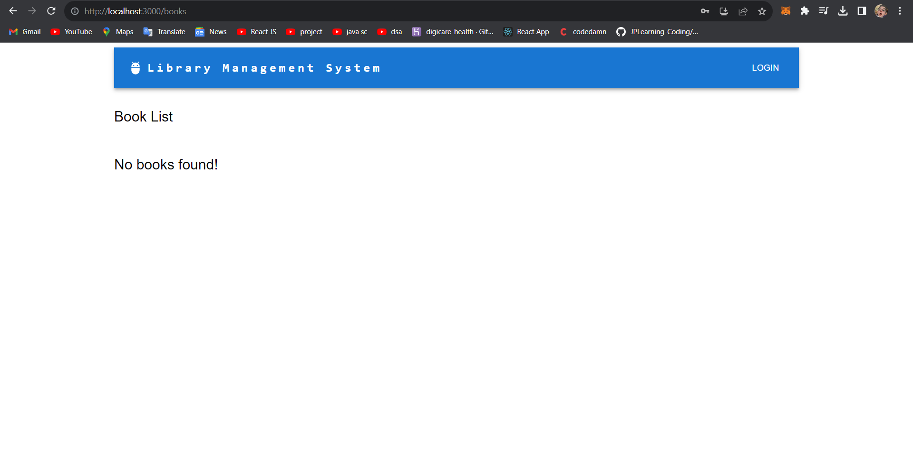

# Library Management System

Welcome to the Library Management System repository! This project aims to provide a comprehensive system for managing library resources. Follow the steps below to get started with the project.

## Getting Started

1. **Clone the Repository:**
   To begin, clone this repository to your local machine using the following command:
git clone https://github.com/Harshkhosla/Library-Management-.git

2. **Navigate to Project Directory:**
Move into the project directory using the command:

cd frontend

3. **Install Server Packages:**
Install the necessary server packages from the root directory:

npm install

4. **Install Client Packages:**
Move to the client directory and install the required client packages:

cd client

npm install

Technologies Used
React JS - For frontend of the Library Management System.
Node JS - For the backend purpose of the Library Management System.
Mongo DB - For the data storing purpose.

